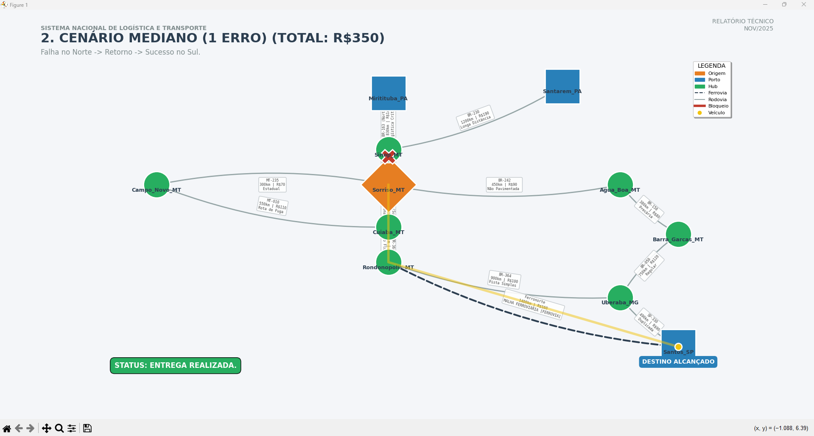
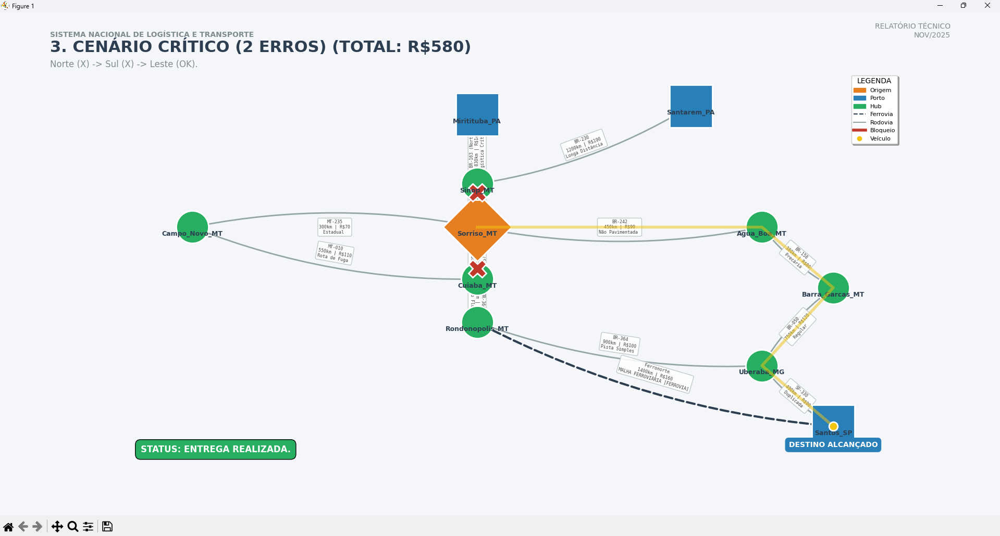
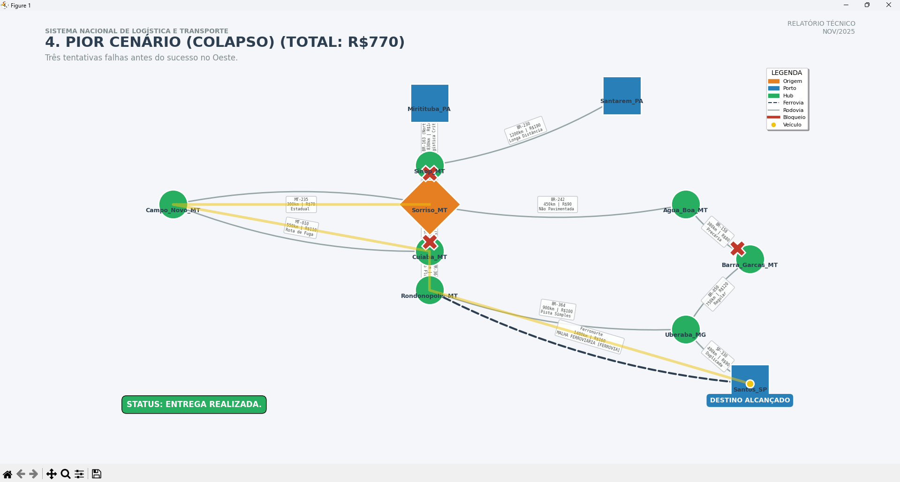
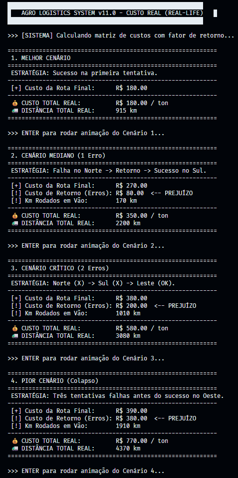

<p align="center">
  
</p>

<h3 align="center">
  Universidade de Vassouras  
</h3>

---

### 📚 Curso: **Engenharia de Software** 
### 🖥️ Disciplina: **Análise de Complexidade de Algoritmos** 
### 👨‍🎓 Autor: **Matheus Beiruth**

---

# Otimização Logística: Escoamento de Soja (MT) 🚛 🇧🇷


> **Simulação Estratégica de Escoamento de Safra (Mato Grosso)**: Uma abordagem baseada em Teoria dos Grafos para análise de resiliência, cálculo de frete multimodal e gestão de crises em tempo real.

---

## 📖 Sobre o Projeto

Este projeto modela a rede de distribuição de soja partindo de **Sorriso (MT)** — o maior produtor nacional — com destino aos portos de exportação. O objetivo é solucionar um problema clássico de Pesquisa Operacional: a escolha entre o **Arco Norte (Porto de Miritituba)** e o **Corredor Sul (Porto de Santos)**.

Diferente de implementações genéricas, este software simula cenários de **falha na infraestrutura crítica** (ex: bloqueio da BR-163), quantificando o impacto financeiro da falta de redundância na malha rodoviária brasileira.

---

## 📊 Dashboard Executivo (Visão Comparativa)

O sistema gera uma matriz de decisão 2x2 comparando quatro cenários táticos lado a lado, permitindo a análise de sensibilidade financeira.


*(Visualização gerada pelo script `main_dashboard.py` demonstrando a disparidade de custos)*

---

## 📍 Detalhamento dos Cenários (Simulação)

O núcleo do projeto (`main.py`) executa uma animação vetorial onde um agente (caminhão) tenta realizar a entrega, reagindo a bloqueios em tempo real.

### 1. Melhor Cenário (Eficiência Máxima)
**Rota:** Sorriso ➔ Sinop ➔ Miritituba (Arco Norte).
**Status:** ✅ Sucesso Imediato.
**Custo:** Baixo (R$ 180/ton).


### 2. Cenário de Contingência (Falha no Norte)
**Rota:** Sorriso ➔ Cuiabá ➔ Santos (Corredor Sul).
**Evento:** Bloqueio na BR-163 Norte. O sistema redireciona para o Sul.
**Impacto:** Aumento de distância e pedágios.



### 3. Cenário Crítico (Falha Norte + Sul)
**Rota:** Sorriso ➔ Água Boa ➔ Uberaba ➔ Santos (Transversal Leste).
**Evento:** Colapso nas vias principais. Uso de estradas de terra/precárias.
**Impacto:** Alto custo de manutenção e tempo.



### 4. Pior Cenário (Colapso Sistêmico)
**Rota:** Sorriso ➔ Campo Novo ➔ Cuiabá ➔ Santos (Rota Oeste).
**Evento:** "Cascata de Falhas". O caminhão tenta Norte (❌), tenta Sul (❌), tenta Leste (❌) e finalmente consegue pelo Oeste.
**Impacto Financeiro:** O custo dobra devido à **Logística Reversa** (viagens perdidas).



---

## 🖥️ Relatório de Engenharia (CLI)

Além da interface gráfica, o sistema fornece um log detalhado no terminal, discriminando o **Custo da Rota Final** vs. **Custo do Desperdício** (quilômetros rodados em vão).



---

## 🛠️ Tecnologias Utilizadas

* **Linguagem:** Python 3.x
* **Core:** `NetworkX` (Estrutura de dados de grafos)
* **Visualização:** `Matplotlib` (Plotagem da rede geográfica e animação)
* **Paradigma:** Programação Orientada a Objetos (POO)

### Arquitetura do Código
O projeto está estruturado na classe `SoyLogisticsNet`, que encapsula:
* `construir_cenario_padrao()`: Definição dos vértices e arestas com metadados (Km, Custo, Tipo de Via).
* `buscar_melhor_rota()`: Algoritmo de caminho mínimo customizado.
* `animar_multiplas_tentativas()`: Motor de simulação que gerencia a lógica de falha e redirecionamento visual.

---

## 🚀 Instalação e Execução

Siga os passos abaixo para rodar o projeto em seu ambiente local.

### Pré-requisitos
Certifique-se de ter o **Python 3.8+** e o **pip** instalados.

### 1. Clonar o repositório
```bash
git clone [https://github.com/BeiruthDEV/otimizacao-logistica-soja.git](https://github.com/BeiruthDEV/otimizacao-logistica-soja.git)
cd otimizacao-logistica-soja
```
### 2. Criar ambiente virtual (Recomendado)
```bash
# Windows
python -m venv venv
.\venv\Scripts\activate

# Linux/Mac
python3 -m venv venv
source venv/bin/activate
```
### 3. Instalar dependências

```bash
pip install -r requirements.txt
```

### 4. Executar
```bash
python main.py
  ```
### 📝 Licença
Distribuído sob a licença MIT. Veja LICENSE para mais informações.